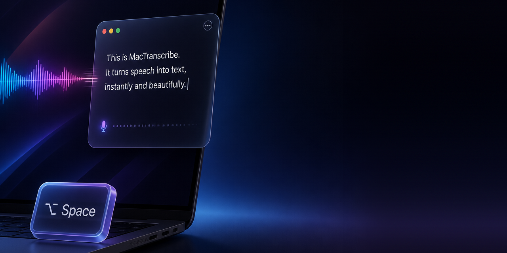

# MacTranscribe

macOS menu bar app: global shortcut → records your voice → transcribes it with the OpenAI
API → you review it → pastes at the cursor or copies it.

Builds **without Xcode**, using only the Command Line Tools.

> The app's interface is in Portuguese. Menu items are quoted below as they appear in the
> app, with an English translation in parentheses.

## Build

```bash
./build.sh
open build/MacTranscribe.app
```

To install it for good: `cp -R build/MacTranscribe.app /Applications/`

## Usage

| Key | Action |
|---|---|
| `⌥Space` | starts recording (in any app) |
| `⌥Space` | stops and transcribes |
| `⎋` | **aborts** — during recording or upload, without transcribing or spending API credits |
| `⏎` | pastes at the cursor of the app you came from |
| `⌘C` | copies to the clipboard |
| `⌥⏎` | line break (while editing the text) |
| `⎋` | discards |

The text shows up in an editable panel, so you can fix it before pasting.

`⎋` exists for accidental triggers: it cancels right away, returns focus to the app you
came from, and nothing is sent. It is registered as a global hotkey **only** while a
recording or upload is in progress — when idle, Esc is never intercepted.

## Permissions

- **Microphone** — required. macOS asks on the first recording.
- **Accessibility** — only needed to paste automatically at the cursor (`⏎`). Without it
  the app still works: the text goes to the clipboard and you paste it with `⌘V`.

Menu bar → **Permissões…** (Permissions) shows the status of both and opens System
Settings.

## Configuration

Everything lives under the 🎤 icon in the menu bar:

- **API key** — stored in the macOS Keychain, never in a file.
- **Shortcut** — presets (`⌥Space`, `⌃⌥D`, `⌃⌥⌘Space`, `⌃⌥V`, `F13`) or **Personalizar…**
  (Customize), which records any combination and warns you immediately if it collides
  with a system shortcut.
- **Model** — `gpt-4o-transcribe` (default), `gpt-4o-mini-transcribe`, `whisper-1`.
- **Language** — pinning a language (e.g. Portuguese) improves accuracy and speed.
- **Vocabulary / context** — names and jargon the model tends to get wrong.
- **Translate to English** — after transcribing, runs **one** translation pass
  (`/v1/chat/completions`, `temperature: 0`) and shows the text already in English. The
  prompt is strict: it only translates, never rewrites or summarizes, and preserves proper
  names, numbers and technical terms. If the translation fails, the panel opens with the
  original text instead of losing what you said.
- **Paste without review** — skips the panel and pastes directly.

## Cost

Audio is sent as AAC 16 kHz mono (~4 KB/s), so uploads are fast.

| Model | Price |
|---|---|
| `gpt-4o-mini-transcribe` | ~US$ 0.003/min |
| `whisper-1` | US$ 0.006/min |
| `gpt-4o-transcribe` | ~US$ 0.006/min |

Translation uses `gpt-4o-mini` (~150 tokens per short sentence, negligible cost). To
switch models without rebuilding:

```bash
defaults write com.allan.mactranscribe translationModel gpt-4.1-mini
```

## Structure

```
Sources/
  main.swift            entry point (LSUIElement, no Dock icon)
  AppDelegate.swift     state machine + menu bar menu
  HotKeyManager.swift   global shortcut via Carbon (no Accessibility required)
  HotKeyRecorder.swift  records a custom shortcut
  SystemHotKeys.swift   detects collisions with macOS-reserved shortcuts
  Recorder.swift        AVAudioRecorder + level meter
  Transcriber.swift     multipart POST to /v1/audio/transcriptions
  Translator.swift      optional translation pass via /v1/chat/completions
  ReviewPanel.swift     editable review panel
  RecordingHUD.swift    floating HUD while recording
  Paster.swift          clipboard + CGEvent ⌘V into the previous app
  Keychain.swift        API key in the Keychain
  Config.swift          preferences (UserDefaults)
```

## Shortcuts reserved by macOS

Be careful when picking a shortcut: `RegisterEventHotKey` **returns `noErr` even for
combinations macOS has already reserved**. The system captures the key before it reaches
any app, so registration "succeeds" and the shortcut simply never fires — with no error
at all.

That's why `⌃⌥Space` doesn't work: it's *"Select next source in Input menu"*, enabled by
default on any Mac with more than one keyboard layout.

Since the API can't detect this, [SystemHotKeys.swift](Sources/SystemHotKeys.swift) reads
`~/Library/Preferences/com.apple.symbolichotkeys.plist` and compares keycode + modifiers
against the system's active shortcuts. The app warns at launch, marks the entry with `⚠︎`
in the menu, and disables the Save button in the shortcut recorder.

To inspect the list yourself:

```bash
plutil -convert xml1 -o - ~/Library/Preferences/com.apple.symbolichotkeys.plist | grep -A8 "<key>61</key>"
```

## Code signing

With an ad-hoc signature (`codesign -s -`), macOS ties the Accessibility permission to the
binary's hash, so every rebuild orphans the authorization and the app keeps asking for it
again.

To avoid that, run once:

```bash
./setup-signing.sh
```

It creates a self-signed certificate, "MacTranscribe Local Dev", in your login keychain,
trusted **only** for code signing. From then on `build.sh` signs with it automatically
and the permission survives rebuilds. The certificate never leaves your machine. To undo:
`./setup-signing.sh --remove`.

Without it, `build.sh` falls back to ad-hoc signing.
